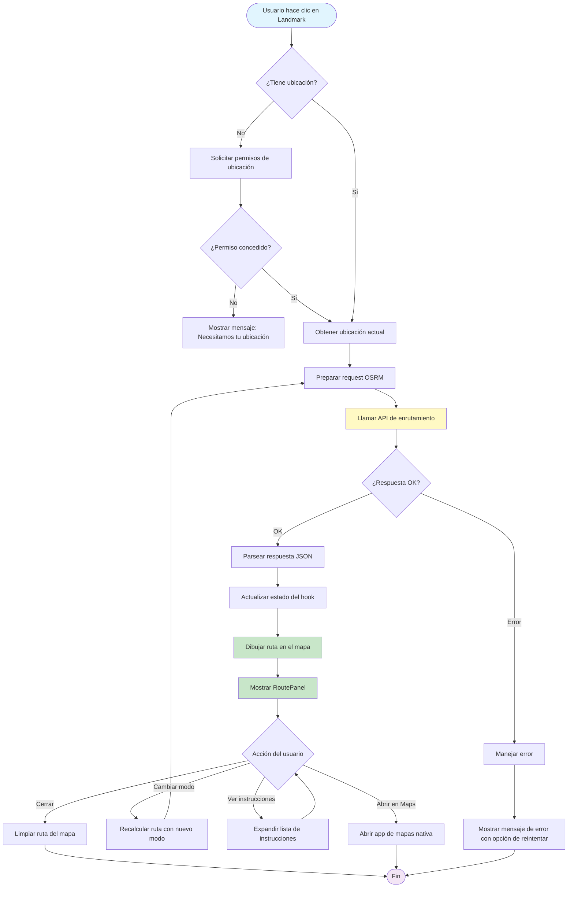
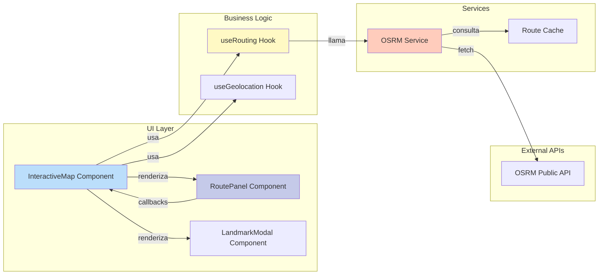
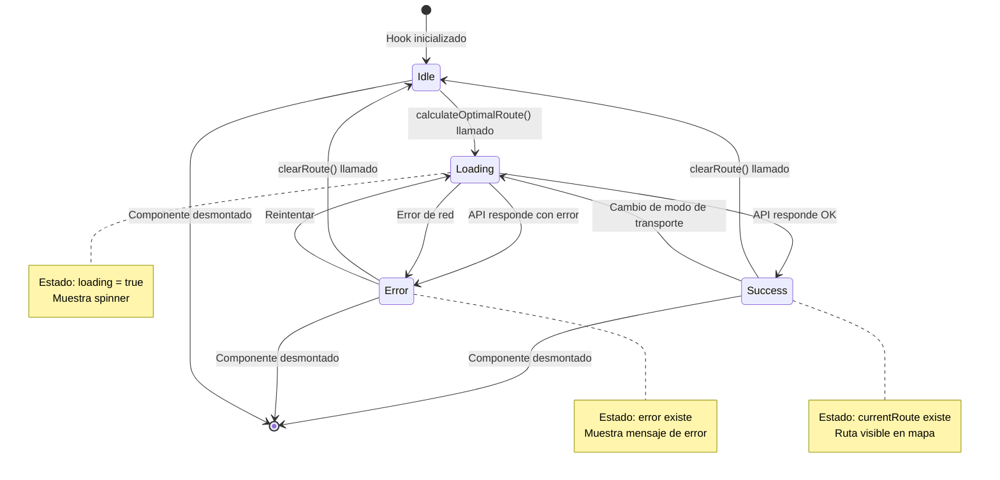
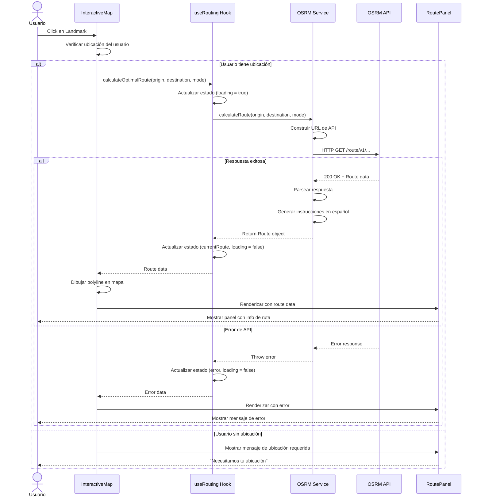
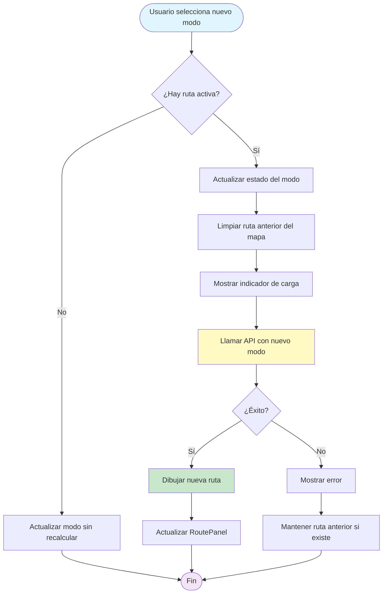
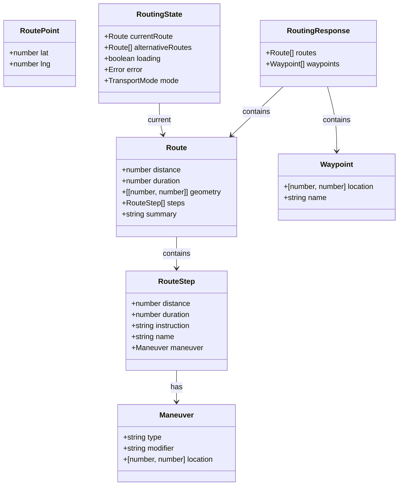
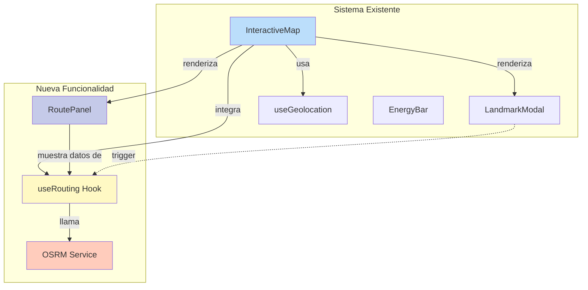
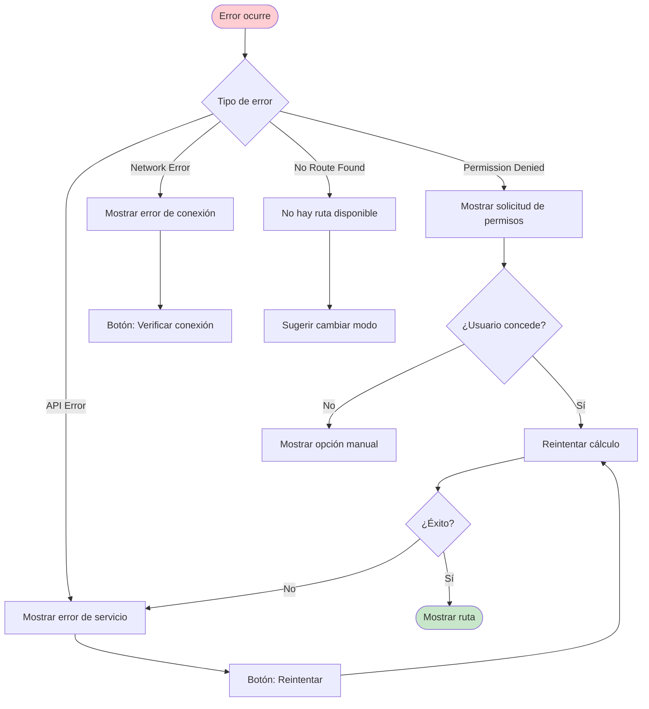

# Diagramas: Sistema de Cálculo de Rutas

## Flujo de Datos Principal

## Arquitectura de Componentes

## Diagrama de Estados del Hook

## Secuencia de Cálculo de Ruta

## Flujo de Cambio de Modo de Transporte

## Modelo de Datos

## Integración con Sistema Existente

## Flujo de Error Handling

---

## Leyenda de Colores

- 🔵 **Azul claro**: Puntos de inicio/fin
- 🟣 **Morado claro**: Estados finales
- 🟡 **Amarillo**: Operaciones de API/Procesamiento
- 🟢 **Verde claro**: Operaciones exitosas/Renderizado
- 🔴 **Rojo claro**: Estados de error
- ⚪ **Blanco**: Estados/Componentes neutrales

---

## Notas Técnicas

1. **Polyline**: La ruta se dibuja usando `L.polyline()` de Leaflet
2. **Geometría**: OSRM devuelve coordenadas en formato [lng, lat], Leaflet espera [lat, lng]
3. **Z-Index**: RoutePanel tiene z-index 1000 para estar sobre el mapa pero bajo modales
4. **Cache**: Las rutas se pueden cachear usando origen+destino+modo como key
5. **Cancelación**: Se usa AbortController para cancelar peticiones pendientes

---

**Última actualización**: 2025-11-20  
**Autor**: Asistente AI

