# Diagramas: Sistema de Cálculo de Rutas

## Flujo de Datos Principal

```mermaid
graph TB
    Start([Usuario hace clic en Landmark])
    
    Start --> CheckLocation{¿Tiene ubicación?}
    
    CheckLocation -->|No| RequestPermission[Solicitar permisos de ubicación]
    RequestPermission --> PermissionGranted{¿Permiso concedido?}
    PermissionGranted -->|No| ShowError[Mostrar mensaje: Necesitamos tu ubicación]
    PermissionGranted -->|Sí| GetLocation[Obtener ubicación actual]
    
    CheckLocation -->|Sí| GetLocation
    
    GetLocation --> PrepareRequest[Preparar request OSRM]
    PrepareRequest --> CallAPI[Llamar API de enrutamiento]
    
    CallAPI --> APIResponse{¿Respuesta OK?}
    
    APIResponse -->|Error| HandleError[Manejar error]
    HandleError --> ShowErrorPanel[Mostrar mensaje de error con opción de reintentar]
    
    APIResponse -->|OK| ParseResponse[Parsear respuesta JSON]
    ParseResponse --> UpdateState[Actualizar estado del hook]
    
    UpdateState --> DrawRoute[Dibujar ruta en el mapa]
    DrawRoute --> ShowPanel[Mostrar RoutePanel]
    
    ShowPanel --> UserAction{Acción del usuario}
    
    UserAction -->|Cambiar modo| RecalculateRoute[Recalcular ruta con nuevo modo]
    RecalculateRoute --> PrepareRequest
    
    UserAction -->|Ver instrucciones| ShowInstructions[Expandir lista de instrucciones]
    
    UserAction -->|Abrir en Maps| OpenNativeApp[Abrir app de mapas nativa]
    
    UserAction -->|Cerrar| ClearRoute[Limpiar ruta del mapa]
    ClearRoute --> End([Fin])
    
    ShowInstructions --> UserAction
    OpenNativeApp --> End
    ShowErrorPanel --> End
    
    style Start fill:#e1f5fe
    style End fill:#f3e5f5
    style CallAPI fill:#fff9c4
    style DrawRoute fill:#c8e6c9
    style ShowPanel fill:#c8e6c9
```

## Arquitectura de Componentes

## Diagrama de Estados del Hook

## Secuencia de Cálculo de Ruta

```mermaid
sequenceDiagram
    actor User as Usuario
    participant IM as InteractiveMap
    participant UR as useRouting Hook
    participant OSRM as OSRM Service
    participant API as OSRM API
    participant RP as RoutePanel
    
    User->>IM: Click en Landmark
    IM->>IM: Verificar ubicación del usuario
    
    alt Usuario tiene ubicación
        IM->>UR: calculateOptimalRoute(origin, destination, mode)
        UR->>UR: Actualizar estado (loading = true)
        UR->>OSRM: calculateRoute(origin, destination, mode)
        
        OSRM->>OSRM: Construir URL de API
        OSRM->>API: HTTP GET /route/v1/...
        
        alt Respuesta exitosa
            API-->>OSRM: 200 OK + Route data
            OSRM->>OSRM: Parsear respuesta
            OSRM->>OSRM: Generar instrucciones en español
            OSRM-->>UR: Return Route object
            UR->>UR: Actualizar estado (currentRoute, loading = false)
            UR-->>IM: Route data
            
            IM->>IM: Dibujar polyline en mapa
            IM->>RP: Renderizar con route data
            RP-->>User: Mostrar panel con info de ruta
            
        else Error de API
            API-->>OSRM: Error response
            OSRM-->>UR: Throw error
            UR->>UR: Actualizar estado (error, loading = false)
            UR-->>IM: Error data
            IM->>RP: Renderizar con error
            RP-->>User: Mostrar mensaje de error
        end
        
    else Usuario sin ubicación
        IM->>RP: Mostrar mensaje de ubicación requerida
        RP-->>User: "Necesitamos tu ubicación"
    end
```

## Flujo de Cambio de Modo de Transporte

```mermaid
graph TD
    Start([Usuario selecciona nuevo modo])
    
    Start --> CheckRoute{¿Hay ruta activa?}
    
    CheckRoute -->|No| UpdateMode[Actualizar modo sin recalcular]
    UpdateMode --> End([Fin])
    
    CheckRoute -->|Sí| UpdateModeState[Actualizar estado del modo]
    UpdateModeState --> ClearOldRoute[Limpiar ruta anterior del mapa]
    ClearOldRoute --> ShowLoading[Mostrar indicador de carga]
    ShowLoading --> CallAPINewMode[Llamar API con nuevo modo]
    
    CallAPINewMode --> Success{¿Éxito?}
    
    Success -->|Sí| DrawNewRoute[Dibujar nueva ruta]
    DrawNewRoute --> UpdatePanel[Actualizar RoutePanel]
    UpdatePanel --> End
    
    Success -->|No| ShowError[Mostrar error]
    ShowError --> KeepOldRoute[Mantener ruta anterior si existe]
    KeepOldRoute --> End
    
    style Start fill:#e1f5fe
    style End fill:#f3e5f5
    style CallAPINewMode fill:#fff9c4
    style DrawNewRoute fill:#c8e6c9
```

## Modelo de Datos

## Integración con Sistema Existente

## Flujo de Error Handling

```mermaid
graph TD
    Error([Error ocurre])
    
    Error --> TypeCheck{Tipo de error}
    
    TypeCheck -->|Permission Denied| ShowPermission[Mostrar solicitud de permisos]
    ShowPermission --> UserGrants{¿Usuario concede?}
    UserGrants -->|Sí| Retry[Reintentar cálculo]
    UserGrants -->|No| ShowManual[Mostrar opción manual]
    
    TypeCheck -->|Network Error| ShowNetwork[Mostrar error de conexión]
    ShowNetwork --> CheckButton[Botón: Verificar conexión]
    
    TypeCheck -->|API Error| ShowAPI[Mostrar error de servicio]
    ShowAPI --> RetryButton[Botón: Reintentar]
    
    TypeCheck -->|No Route Found| ShowNoRoute[No hay ruta disponible]
    ShowNoRoute --> SuggestMode[Sugerir cambiar modo]
    
    RetryButton --> Retry
    Retry --> Success{¿Éxito?}
    Success -->|Sí| ShowRoute([Mostrar ruta])
    Success -->|No| ShowAPI
    
    style Error fill:#ffcdd2
    style ShowRoute fill:#c8e6c9
```

---

## Leyenda de Colores

- 🔵 **Azul claro**: Puntos de inicio/fin
- 🟣 **Morado claro**: Estados finales
- 🟡 **Amarillo**: Operaciones de API/Procesamiento
- 🟢 **Verde claro**: Operaciones exitosas/Renderizado
- 🔴 **Rojo claro**: Estados de error
- ⚪ **Blanco**: Estados/Componentes neutrales

---

## Notas Técnicas

1. **Polyline**: La ruta se dibuja usando `L.polyline()` de Leaflet
2. **Geometría**: OSRM devuelve coordenadas en formato [lng, lat], Leaflet espera [lat, lng]
3. **Z-Index**: RoutePanel tiene z-index 1000 para estar sobre el mapa pero bajo modales
4. **Cache**: Las rutas se pueden cachear usando origen+destino+modo como key
5. **Cancelación**: Se usa AbortController para cancelar peticiones pendientes

---

**Última actualización**: 2025-11-20  
**Autor**: Asistente AI

